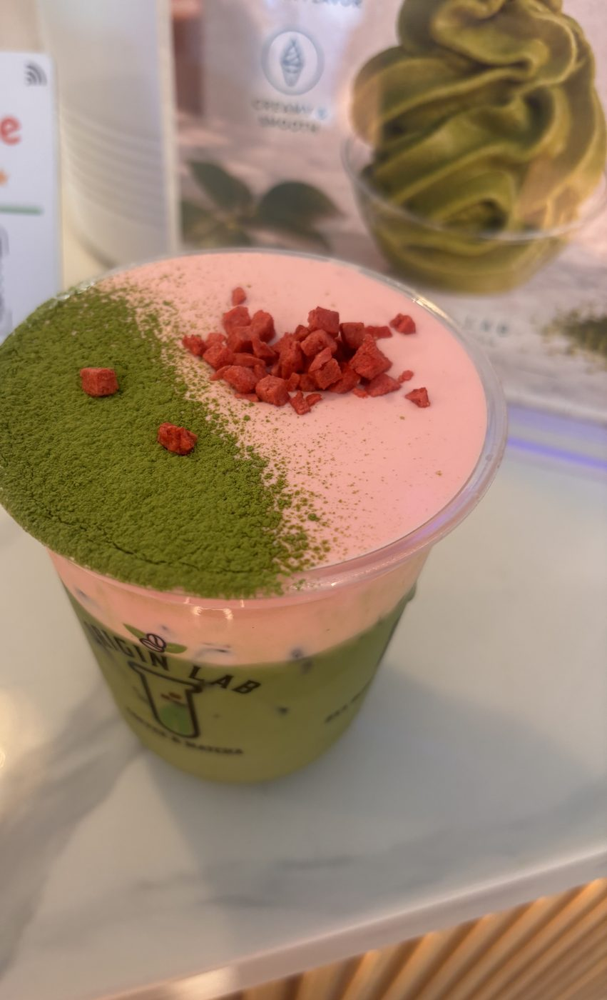
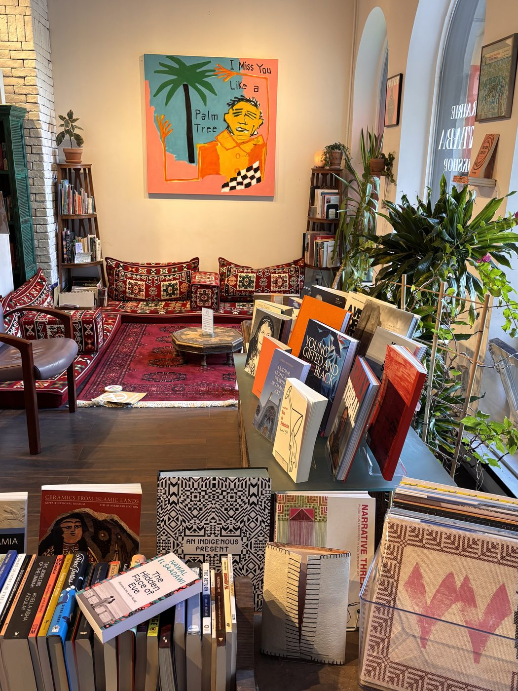

::: {.about-grid}

{.portrait fig-alt="Portrait of Sara Scribner"}

::: {.prose}
I'm an analyst at Sephora Media Network and a graduate student in Applied Business Analytics at Boston University. I began in psychology and mathematics, then moved through store operations and product management. Today I work with data every day to show what is really driving performance.

I like to see a problem from every side: the stakeholder, the end user, and the business. And I care about amplifying the voice or the detail that is easy to overlook.

I'm also a word-puzzle person, which is why this site is built like a game. [Here's the reason.](index.html#why)
:::

:::

## Education

::: {.entry}
::: {.when}
Expected May 2027
:::
::: {.what}
### Master of Science in Applied Business Analytics
Boston University
:::
:::

::: {.entry}
::: {.when}
May 2024
:::
::: {.what}
### Bachelor of Arts in Psychology, Minor in Mathematics
Western Connecticut State University
:::
:::

## Skills

My skills, set as a crossword. Every answer is a tool or method I use, and hovering over a clue lights up its word.

```{=html}
<div class="xw">
  <div class="xw-grid" style="--cols:12;--rows:12" role="img" aria-label="A crossword puzzle whose answers are my skills. Clues are listed beside it.">
<div class="xw-cell" style="grid-row:1;grid-column:3" data-w="2"><i>1</i>S</div>
<div class="xw-cell" style="grid-row:1;grid-column:4" data-w="2 3"><i>2</i>T</div>
<div class="xw-cell" style="grid-row:1;grid-column:5" data-w="2">O</div>
<div class="xw-cell" style="grid-row:1;grid-column:6" data-w="1 2"><i>3</i>R</div>
<div class="xw-cell" style="grid-row:1;grid-column:7" data-w="2">I</div>
<div class="xw-cell" style="grid-row:1;grid-column:8" data-w="2">E</div>
<div class="xw-cell" style="grid-row:1;grid-column:9" data-w="2">S</div>
<div class="xw-cell" style="grid-row:1;grid-column:11" data-w="9"><i>4</i>J</div>
<div class="xw-cell" style="grid-row:2;grid-column:1" data-w="6"><i>5</i>M</div>
<div class="xw-cell" style="grid-row:2;grid-column:4" data-w="3">A</div>
<div class="xw-cell" style="grid-row:2;grid-column:6" data-w="1">E</div>
<div class="xw-cell" style="grid-row:2;grid-column:11" data-w="9">I</div>
<div class="xw-cell" style="grid-row:3;grid-column:1" data-w="6">E</div>
<div class="xw-cell" style="grid-row:3;grid-column:4" data-w="3">B</div>
<div class="xw-cell" style="grid-row:3;grid-column:6" data-w="1 5"><i>6</i>P</div>
<div class="xw-cell" style="grid-row:3;grid-column:7" data-w="5">Y</div>
<div class="xw-cell" style="grid-row:3;grid-column:8" data-w="5">S</div>
<div class="xw-cell" style="grid-row:3;grid-column:9" data-w="5">P</div>
<div class="xw-cell" style="grid-row:3;grid-column:10" data-w="5">A</div>
<div class="xw-cell" style="grid-row:3;grid-column:11" data-w="5 9">R</div>
<div class="xw-cell" style="grid-row:3;grid-column:12" data-w="5">K</div>
<div class="xw-cell" style="grid-row:4;grid-column:1" data-w="6">T</div>
<div class="xw-cell" style="grid-row:4;grid-column:4" data-w="3">L</div>
<div class="xw-cell" style="grid-row:4;grid-column:6" data-w="1">O</div>
<div class="xw-cell" style="grid-row:4;grid-column:11" data-w="9">A</div>
<div class="xw-cell" style="grid-row:5;grid-column:1" data-w="4 6"><i>7</i>R</div>
<div class="xw-cell" style="grid-row:5;grid-column:2" data-w="4">E</div>
<div class="xw-cell" style="grid-row:5;grid-column:3" data-w="4">S</div>
<div class="xw-cell" style="grid-row:5;grid-column:4" data-w="3 4">E</div>
<div class="xw-cell" style="grid-row:5;grid-column:5" data-w="4">A</div>
<div class="xw-cell" style="grid-row:5;grid-column:6" data-w="1 4">R</div>
<div class="xw-cell" style="grid-row:5;grid-column:7" data-w="4">C</div>
<div class="xw-cell" style="grid-row:5;grid-column:8" data-w="4">H</div>
<div class="xw-cell" style="grid-row:6;grid-column:1" data-w="6">I</div>
<div class="xw-cell" style="grid-row:6;grid-column:4" data-w="3">A</div>
<div class="xw-cell" style="grid-row:6;grid-column:6" data-w="1">T</div>
<div class="xw-cell" style="grid-row:7;grid-column:1" data-w="6">C</div>
<div class="xw-cell" style="grid-row:7;grid-column:4" data-w="3">U</div>
<div class="xw-cell" style="grid-row:7;grid-column:6" data-w="1">I</div>
<div class="xw-cell" style="grid-row:7;grid-column:9" data-w="7"><i>8</i>P</div>
<div class="xw-cell" style="grid-row:8;grid-column:1" data-w="6">S</div>
<div class="xw-cell" style="grid-row:8;grid-column:5" data-w="0"><i>9</i>A</div>
<div class="xw-cell" style="grid-row:8;grid-column:6" data-w="0 1">N</div>
<div class="xw-cell" style="grid-row:8;grid-column:7" data-w="0">A</div>
<div class="xw-cell" style="grid-row:8;grid-column:8" data-w="0">L</div>
<div class="xw-cell" style="grid-row:8;grid-column:9" data-w="0 7">Y</div>
<div class="xw-cell" style="grid-row:8;grid-column:10" data-w="0">S</div>
<div class="xw-cell" style="grid-row:8;grid-column:11" data-w="0">I</div>
<div class="xw-cell" style="grid-row:8;grid-column:12" data-w="0">S</div>
<div class="xw-cell" style="grid-row:9;grid-column:6" data-w="1">G</div>
<div class="xw-cell" style="grid-row:9;grid-column:9" data-w="7">T</div>
<div class="xw-cell" style="grid-row:10;grid-column:9" data-w="7">H</div>
<div class="xw-cell" style="grid-row:11;grid-column:7" data-w="8"><i>10</i>P</div>
<div class="xw-cell" style="grid-row:11;grid-column:8" data-w="8">L</div>
<div class="xw-cell" style="grid-row:11;grid-column:9" data-w="7 8">O</div>
<div class="xw-cell" style="grid-row:11;grid-column:10" data-w="8">T</div>
<div class="xw-cell" style="grid-row:11;grid-column:11" data-w="8">L</div>
<div class="xw-cell" style="grid-row:11;grid-column:12" data-w="8">Y</div>
<div class="xw-cell" style="grid-row:12;grid-column:9" data-w="7">N</div>
  </div>
  <div class="xw-clues">
    <h3>Across</h3>
    <ol>
<li class="xw-clue" data-w="2" value="1"><span class="xw-text">User ___ with acceptance criteria (7)</span><span class="sr-only"> Answer: Stories.</span></li>
<li class="xw-clue" data-w="5" value="6"><span class="xw-text">Spark's Python interface, used to process large datasets (7)</span><span class="sr-only"> Answer: Pyspark.</span></li>
<li class="xw-clue" data-w="4" value="7"><span class="xw-text">Where every product question starts (8)</span><span class="sr-only"> Answer: Research.</span></li>
<li class="xw-clue" data-w="0" value="9"><span class="xw-text">Turning raw numbers into decisions (8)</span><span class="sr-only"> Answer: Analysis.</span></li>
<li class="xw-clue" data-w="8" value="10"><span class="xw-text">Library for interactive charts (6)</span><span class="sr-only"> Answer: Plotly.</span></li>
    </ol>
    <h3>Down</h3>
    <ol>
<li class="xw-clue" data-w="3" value="2"><span class="xw-text">Dashboard tool I use to track store and campaign performance (7)</span><span class="sr-only"> Answer: Tableau.</span></li>
<li class="xw-clue" data-w="1" value="3"><span class="xw-text">Automated wrap reports for brand teams (9)</span><span class="sr-only"> Answer: Reporting.</span></li>
<li class="xw-clue" data-w="9" value="4"><span class="xw-text">Where I log bugs and manage QA (4)</span><span class="sr-only"> Answer: Jira.</span></li>
<li class="xw-clue" data-w="6" value="5"><span class="xw-text">ROAS, CPC, CPM, and CTR (7)</span><span class="sr-only"> Answer: Metrics.</span></li>
<li class="xw-clue" data-w="7" value="8"><span class="xw-text">Language behind my data projects (6)</span><span class="sr-only"> Answer: Python.</span></li>
    </ol>
  </div>
</div>
```

## Interests

I'm drawn to retail media and campaign analytics, product management and customer experience, machine learning and predictive modeling, big data processing with Apache Spark, and data storytelling.

## Career Goals

I'm always looking to advance my knowledge and combine business, research, and technical skills to help teams make better decisions, especially in retail, media, and consumer products. I want to build analysis that is accurate, clear, and centered on the client.

## Beyond the Data

Away from the screen, you'll find me with matcha, my cats, or a good book.

::: {.triptych}
::: {.col}
{fig-alt="A strawberry matcha topped with matcha powder and freeze-dried strawberry pieces"}

### Matcha
I love matcha, and this was one of my favorites!
:::
::: {.col}
{fig-alt="A fluffy gray and white cat napping in a woven basket"}

### Cats
My cats, Leite and Mabel!
:::
::: {.col}
{fig-alt="The reading corner of a bookshop, with tables of books and a colorful painting on the wall"}

### Books
My favorite bookshop in Montreal (I love to read).
:::
:::
