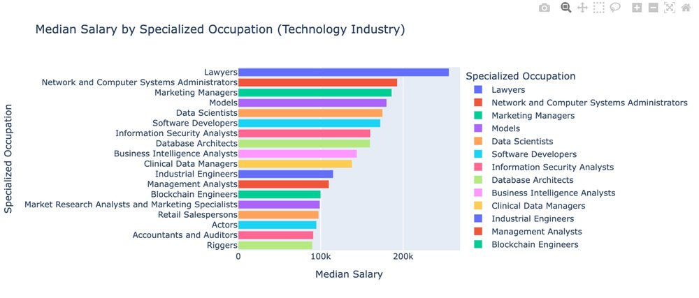
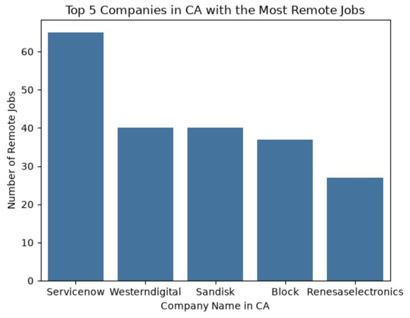

Selected analytics work from my graduate studies.

::: {.work}
::: {.work-meta}
**Tools**  
PySpark, Plotly, Parquet

**Code**  
[View the repository](https://github.com/met-ad-688/688-f26-o1-m03-a-sscribner)
:::
::: {.work-body}
## Job Market Analysis with PySpark

I analyzed a 2026 job postings dataset of 21 Parquet files to understand how salary and demand vary across the market. I cleaned the data in PySpark, filled missing salaries with medians, and built interactive Plotly charts.

- Project management specialists have the most postings by far, at about 111,000.
- Salaries show the widest spread around one year of experience, and the spread narrows as education level rises.
- Full-time roles have the tightest salary ranges, while part-time roles have the lowest.
- Remote roles span the widest range of experience requirements, and onsite roles cluster at five to ten years.
:::
:::

::: {.work}
::: {.work-meta}
**Tools**  
Python, Plotly

**Code**  
[View the repository](https://github.com/met-ad-688/688-f26-o1-m02-a-sscribner)
:::
::: {.work-body}
## California Tech Job Market Analysis

Four queries on a job postings dataset answered practical career questions about pay, remote work, and hiring timing in California's technology industry. Each result became a chart with written insights.

- Median salaries for specialized tech occupations range from about $90,000 to $255,000, with most near $150,000.
- ServiceNow leads California companies with 65 remote postings, well ahead of Western Digital and SanDisk at 40 each.
- Posting volume holds steady until a spike in June, then falls to just above baseline.
- Among the metro areas in the data, Washington, DC has the highest average salary, followed closely by New York, with Dallas much lower.

{fig-alt="Bar chart of median salary by specialized tech occupation"}

{fig-alt="Bar chart of the top five California companies by remote job postings" width=60%}
:::
:::
